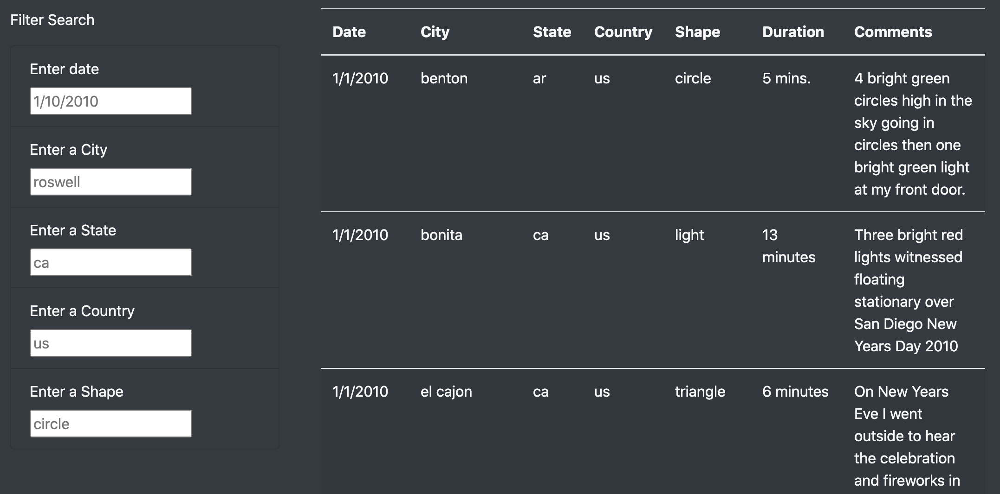
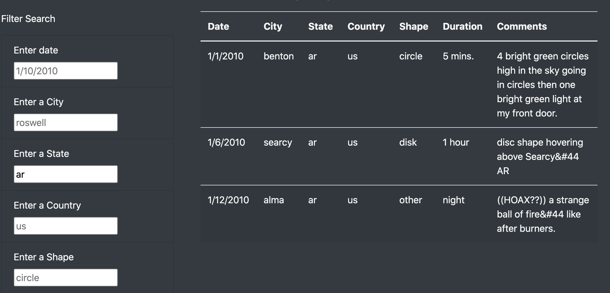
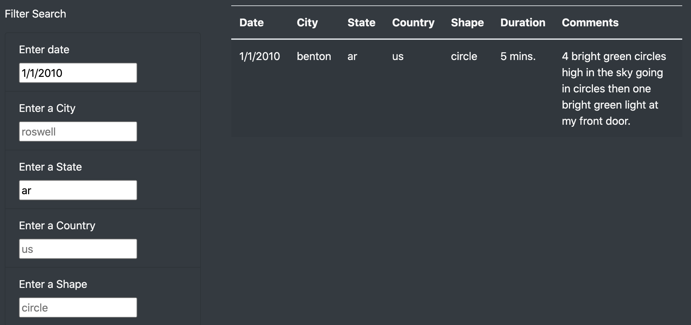

# Exploring UFO sightings

## Overview

This webpage is designed to provide a responsive dashboard to view data on UFO sightings in the USA. Here, we allow the user to provide search parameters and filter our dataset accordingly to only present relevant results.

**Technologies used:**
* JavaScript ES6
* D3
* CSS
* HTML5
* Bootstrap

## Walkthrough and Usage

The single page used includes some basic styling, accessed through Bootstrap's built-in classes and embedded images. 

Further down, we can see a table, separated by a panel of filters:

By typing in a **lower-case only** two-letter state code on the left, we can filter our table responsively, without having to refresh the page:

Filters can be combined. To go further. if I only wanted to view UFO sightings from Arkansas on New Years Day in 2010, I would add '1/1/2010' plus the existing 'ar' filter. The page automatically updates the search parameters and returns relevant results only:

## Limitations & Recommendations

* One drawback of this design is that it takes very specific search criteria. For example, passing in "AR" instead of "ar" in the state search criteria will return no results. Similarly, adding "Jan-01-2010" as a date, versus "1/1/2010", will return no results.

* In order to address the above limitation, I would definitely add back-end data cleaning in `app.js` to convert all state values from any caps to lowercase. This would extend to all other text parameters.

* Additionally, I would use regular expressions to ensure the filter could handle multiple date types and normalize them. 

* I would also potentially add some error handling to enforce only certain date types; for example, returning an error if a number is entered into the state code field.
